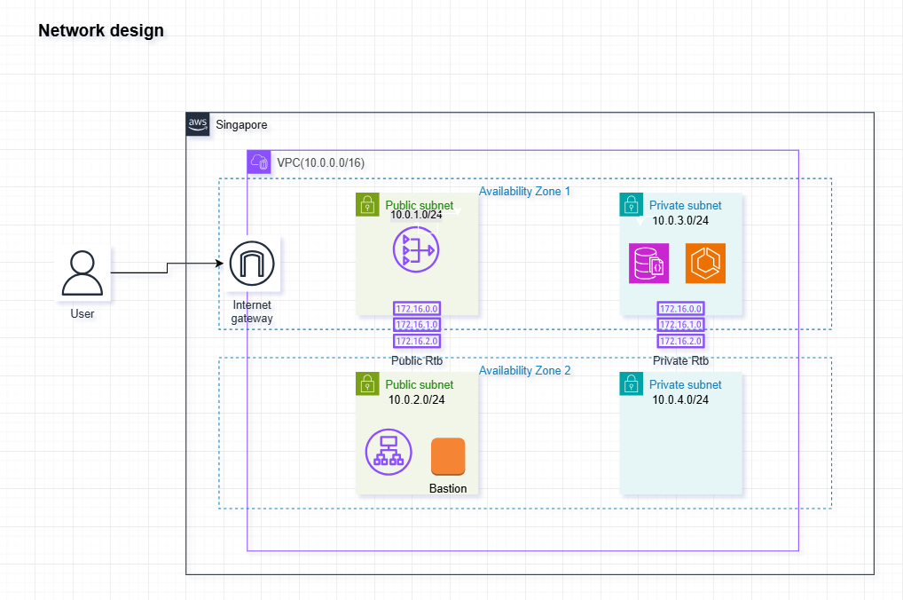
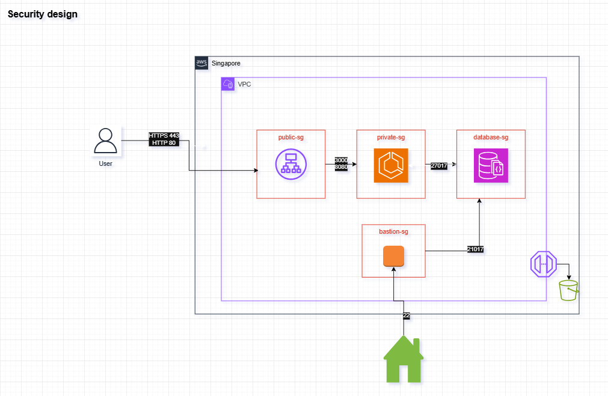
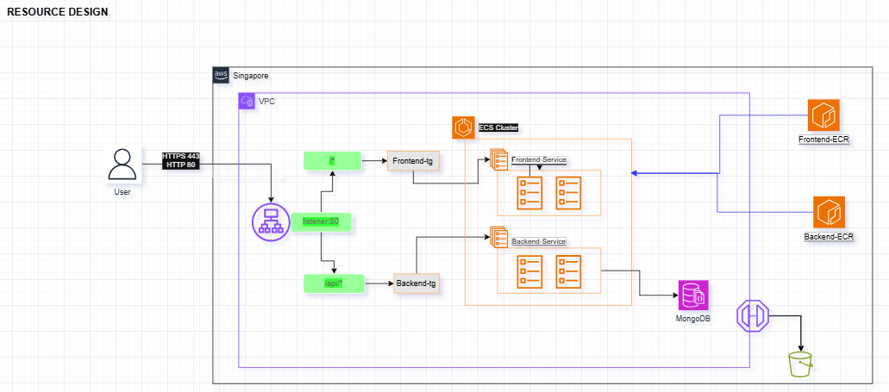

## Đây là một hệ thống gồm 3 thành phần: Frontend, Backend & Database dùng để các bạn luyện tập việc triển khai hệ thống lên AWS .
## run bởi docker-compose:
- `docker-compose -f docker-compose.yaml up -d`
- Sau đó truy cập vào `localhost:3000` để xem website. Thử add một vài user, view list users.

## Giải thích về cấu trúc project
### Frontend
- Nodejs project có nhiệm vụ list, add, delete users.
- Dockerfile build ra image base trên Node20, expose port 3000.
- Docker image nhận biến môi trường: REACT_APP_API_URL là url của API Backend. vd: localhost:8080
### Backend
- Java Spring boot có nhiệm vụ cung cấp API list, add, delete users.
- Dockerfile file build ra image chạy trên Java OpenJDK, expose port 8080.
- Docker image nhận biến môi trường: MONGO_URL là url của MongoDB. vd: mongodb://database:27017/dev (*do Mongo local không set password, nếu sd DocumentDB connection URL sẽ khác.)
### Database
- Sử dụng image Mongo:5.0, port 27017.

### Phương án 1:
- Frontend: Serverside Rendering trên ECS, ECR.
- Backend: ECS, ECR.
- Database: Document DB.
- Load Balance: ALB
- CICD sử dụng một trong các giải pháp: Jenkins, GithubAction hoặc CodePipeline.
- Chiến lược deploy cho backend: Rolling update hoặc Blue-Green.
### Phương án 2:
- Frontend: S3 + CloudFront.
- Backend: ECS, ECR.
- Database: Document DB.
- Load Balance: ALB
- CICD sử dụng một trong các giải pháp: Jenkins, GithubAction hoặc CodePipeline.
- Chiến lược deploy cho backend: Rolling update hoặc Blue-Green.


### Phương án cho kiến trúc 1: Frontend & Backend đều triển khai lên ECS, DB: Document DB chạy Mongo, kết hợp ALB.

### Step thực hiện:
#### 1. Tạo network (VPC, Subnet), Security Group & ECS Cluster, ECR repository cho FE, BE.
#### 2. Tạo Document DB (Mongo Engine version 5.0)
* Tạo một Custom Parameter group từ Mongo 5.0, tắt TLS=Disabled, save lại.*Lý do: Source code cung cấp sẵn chưa work với mode TLS Enabled của Mongo.
* Tạo một Document DB Cluster sử dụng Mongo Engine 5.0. *Trong giao diện tạo Document DB, chọn option: ```Instance Based Cluster```
* Chọn instance size db.t3.medium, Engine: 5.0.0, Number of instances: 1
* Parameter group: Chọn Parameter group tạo ra ở bước trên.
* Đặt username/password cho Cluster. Lưu ý username phải khác ```admin```
* Cấu hình Security group cần thiết cho Cluster (Port 27017)
* Sử dụng một EC2 có cài sẵn mongosh để kết nối thử đến Database. Troubleshoot nếu có issue.  
<span style="color: red;">*Lưu ý: DocumentDB của AWS hiện không hỗ trợ kết nối từ máy local (thông qua internet) nên bạn buộc phải tạo ra một EC2 instance cùng VPC với MongoDB, cài mongosh lên đó sau đó thử kết nối bằng câu lệnh</span> 
* Tham khảo link của AWS: `https://docs.aws.amazon.com/documentdb/latest/developerguide/troubleshooting.connecting.html#troubleshooting.cannot-connect.public-endpoints`


#### 3. Tạo sẵn một Application Load Balancer
- Tạo Application Load Balancer, listener port 80 (hoặc 443 nếu có SSL).
- Tạo 2 target group: 
- frontend-tg: Type IP, port 3000, Healthcheck default. 
- backend-tg: Type IP, port 8080, Healthcheck: /api/students overwrite health checkport 8080
- Cấu hình trên Application Load Balancer để rule /api/* trỏ vào backend-tg, còn lại default trỏ vào frontend-tg

#### 4. ⁠Triển khai Backend
- Build Dockerimage và push lên ECR. 
- Tạo Backend Task definition, lưu ý overwrite `MONGO_URL` cho backend (lưu ý password đang lưu plaintex, cần cải thiện trong tương lai sử dụng Secret Manager)
- Tạo Backend Service, chọn backend-target-group, listener tương ứng.
- Test API vd GET ```<alb-domain>:80/api/students```, kết quả trả về danh sách students theo dạng Json là OK.

#### 5. Triển khai Frontend
- Build Frontend tạo ra Docker image, push lên ECR.

- Tạo Frontend Task definition, lưu ý overwrite `REACT_APP_API_URL` để frontend nhận diện được backend API theo cấu trúc: ```<alb-domain>:80```

- Tạo Frontend Service, chọn frontend-target-group, listener tương ứng.

#### 6. Test kết nối tới ALB & truy cập ứng dụng, thử add/delete user

#### 7. Sơ đồ thiết kế theo phương án 1
### Networking

### Security

### Resources
